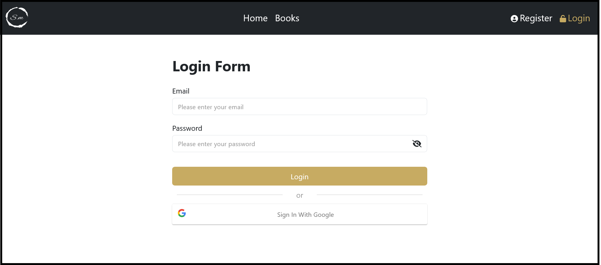

# [React & Firebase] (https://firebase-crud-auth-pi.vercel.app/login)

## Table of contents

- [Overview](#overview)
  - [About](#About)
  - [Screenshot](#screenshot)
  - [Built with](#built-with)

## Overview
### About
website is a practise of learning firebase and react:

- Regiseteration / logging-in system
- sigin with email/password and google
- User account
- crud operation of book store
- uploading images

### Screenshot

### Built with

- Semantic HTML5 markup
- CSS
- JavaScript
- Bootstrap
- React-Bootstrap
- React
- React-router
- Redux
- Font Awesome
- Formik
- Yup
- firebase
- firebase auth
- firebase firestore
- firebase storage
